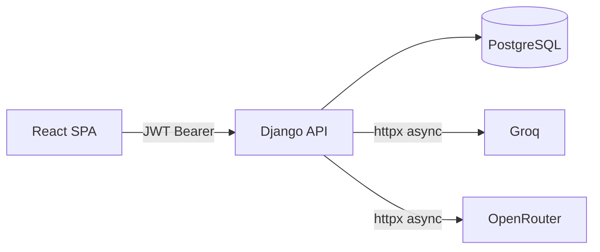

# PromptVault

A personal LLM prompt library with execution tracking and a usage dashboard.

Save prompts, run them against Groq or OpenRouter, and track every execution —
latency, token counts, and success rate — in one place.

## Features

- **Prompt library** — create, edit, search, and tag prompts
- **Multi-provider execution** — run any prompt against Groq or OpenRouter with one click
- **Execution history** — every run is persisted with result text, token usage, and latency
- **Usage dashboard** — 7-day and 30-day stats: success rate, avg latency, tokens by provider, executions-per-day chart
- **Provider health** — live canary check shown in the sidebar (cached 60 s)
- **JWT authentication** — register/login, auto-refresh tokens, protected routes

## Screenshots

> Capture screenshots by running the app locally (see Quick Start), then save images to `docs/screenshots/`.

| Dashboard | Prompt Detail |
|-----------|---------------|
|  |  |

| Execution Panel | Login |
|-----------------|-------|
|  |  |

## Stack

| Layer | Technology |
|-------|------------|
| Backend | Django 5, Django REST Framework, SimpleJWT |
| Database | PostgreSQL 16 |
| Frontend | React 19, Vite, TypeScript, Tailwind CSS 4 |
| Charts | Recharts |
| LLM Providers | Groq (free tier), OpenRouter (free tier) |
| Auth | JWT — access 15 min, refresh 7 days |
| Infra | Docker Compose, GitHub Actions CI |

## Architecture



PromptVault is intentionally a **monolith** — one Django project, one database, one React SPA.
Single-user scope does not justify distributed complexity.

## Quick Start

### With Docker (recommended)

```bash
git clone https://github.com/daniyalmlik/promptvault.git
cd promptvault

cp .env.example .env
# Edit .env — set GROQ_API_KEY and/or OPENROUTER_API_KEY

docker compose up --build
```

Frontend: http://localhost:5173 · API: http://localhost:8000/api/

### Manual

**Backend:**

```bash
cd backend
python -m venv .venv && source .venv/bin/activate
pip install -r requirements.txt
cp ../.env.example ../.env   # fill in values
python manage.py migrate
python manage.py runserver
```

**Frontend:**

```bash
cd frontend
pnpm install
pnpm dev
```

### Environment Variables

| Variable | Required | Description |
|----------|----------|-------------|
| `SECRET_KEY` | Yes | Django secret key |
| `DATABASE_URL` | Yes | PostgreSQL connection string |
| `GROQ_API_KEY` | No | Free at console.groq.com |
| `OPENROUTER_API_KEY` | No | Free at openrouter.ai |
| `DEBUG` | No | Set `True` for development |

## API Endpoints

| Method | Path | Auth | Description |
|--------|------|------|-------------|
| `POST` | `/api/auth/register/` | — | Create account |
| `POST` | `/api/auth/token/` | — | Obtain JWT pair |
| `POST` | `/api/auth/token/refresh/` | — | Refresh access token |
| `GET` | `/api/auth/me/` | JWT | Current user |
| `GET/POST` | `/api/prompts/` | JWT | List / create prompts |
| `GET/PUT/DELETE` | `/api/prompts/{id}/` | JWT | Prompt detail |
| `GET/POST` | `/api/executions/` | JWT | List / run executions |
| `GET` | `/api/executions/stats/` | JWT | Aggregated usage stats |
| `GET` | `/api/providers/health/` | — | Provider liveness check |

## Running Tests

**Backend** (84 tests, ~99% coverage):

```bash
cd backend
pytest --tb=short
```

**Frontend** (74 tests, ~77% line coverage):

```bash
cd frontend
pnpm exec vitest run --coverage
```
