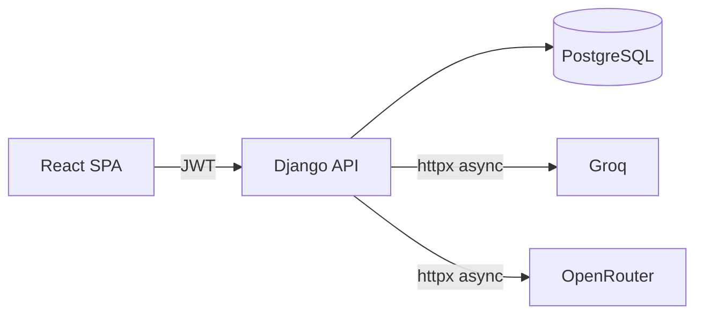

# PromptVault

A personal LLM prompt library with execution tracking and a usage dashboard.

Save prompts, run them against Groq or OpenRouter, and track every execution — latency, token counts, costs — in one place.

## Stack

- **Backend:** Django 5 + Django REST Framework + PostgreSQL + SimpleJWT
- **Frontend:** React 18 + Vite + TypeScript + Tailwind CSS
- **LLM Providers:** Groq, OpenRouter (both free tier, OpenAI-compatible)
- **Infra:** Docker Compose + GitHub Actions CI

## Local setup

```bash
cp .env.example .env          # fill in GROQ_API_KEY and OPENROUTER_API_KEY
docker compose up --build
```

API at `http://localhost:8000` · UI at `http://localhost:5173`

## Architecture

See [IMPLEMENTATION_PLAN.md](IMPLEMENTATION_PLAN.md) for a full phase-by-phase build plan.



PromptVault is intentionally a **monolith**. One Django project, one database, one React SPA. The scope (single user, one bounded context) does not justify distributed complexity.
